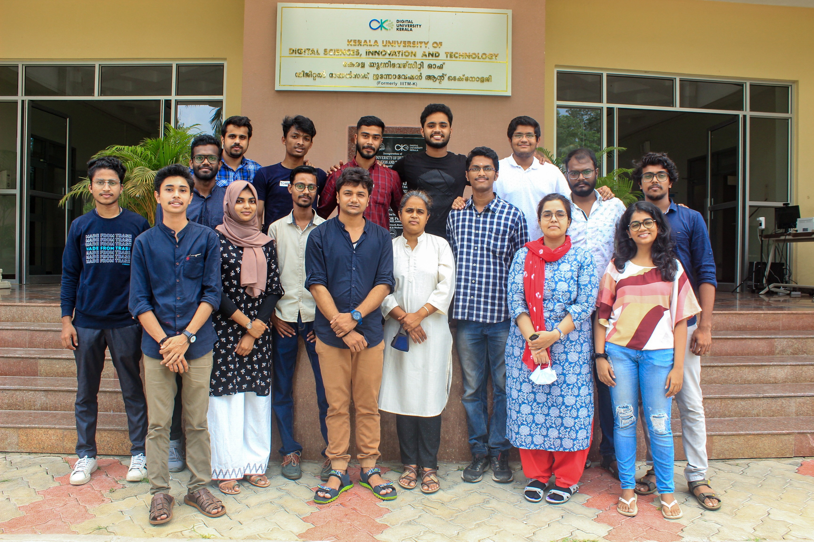

## Research Interests
* [Bayesian Optimization](https://en.wikipedia.org/wiki/Bayesian_optimization) for Industrial Applications
* [Machine Learning](https://en.wikipedia.org/wiki/Machine_learning)  

## Openings
* [Mar 2023] [PhD Openings](https://duk.ac.in/admissions2023/): 
    Currently seeking brilliant and highly motivated PhD students to join our research group. 
    
    
    
## Contact Details
&nbsp;&nbsp;&nbsp;&nbsp;&nbsp;&nbsp;Optimization and Machine Learning Lab 
&nbsp;&nbsp;&nbsp;&nbsp;&nbsp;&nbsp;Digital University Kerala (formerly IIITM-Kerala) 
&nbsp;&nbsp;&nbsp;&nbsp;&nbsp;&nbsp;Technocity, Mangalapuram 
&nbsp;&nbsp;&nbsp;&nbsp;&nbsp;&nbsp;PO Thonnakkal,Thiruvananthapuram  
&nbsp;&nbsp;&nbsp;&nbsp;&nbsp;&nbsp;Kerala 695 317 India   
&nbsp;&nbsp;&nbsp;&nbsp;&nbsp;&nbsp;+91-471-2788088  
  

 

  

<small>Successful and unsuccessful people do not vary greatly in their abilities.They vary in their desires to reach their potential. – John Maxwell </small>

